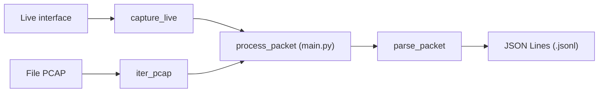

# Bài tập 1 - Packet Capture & Parser cho IDS

- Chương trình Python thu thập gói tin từ **card mạng đang hoạt động** hoặc **file PCAP**, đọc thông tin IPv4, TCP/UDP, HTTP/1.x, DNS và SMTP, rồi ghi kết quả thành **JSON Lines - mỗi gói tin một dòng JSON**.

> Nhằm làm nền tảng cho các module tiếp theo.

Ví dụ: với một gói HTTP GET, chương trình cho biết IP và port nguồn/đích, phương thức `GET`, đường dẫn được yêu cầu và các HTTP header. Với DNS Response, chương trình lấy được tên miền và địa chỉ trong bản ghi trả lời.

**Phạm vi hiện tại là thu thập và phân tích gói tin của Bài tập 1.** Chưa có rules phát hiện tấn công, cảnh báo hay ngăn chặn xâm nhập.

## 1. Các chức năng hiện tại

| Yêu cầu trong đề | Chức năng đã triển khai |
| --- | --- |
| Live capture | Liệt kê và chọn interface; bắt từng gói, giữ timestamp và chuyển ngay sang parser. Có giới hạn số gói/thời gian và dừng bằng Ctrl+C. |
| Import PCAP | Đọc lần lượt các gói trong file PCAP, giữ timestamp đã lưu và dùng **cùng parser với live capture**. |
| Phân tích IPv4 | Lấy IP nguồn/đích, phiên bản, TTL, protocol, tổng độ dài và thông tin phân mảnh. |
| Phân tích TCP/UDP | TCP: port, sequence, acknowledgment, flags, window và độ dài payload. UDP: port, độ dài datagram và payload. |
| Phân tích HTTP/1.x | Request: method, URI, version, headers, body. Response: version, status code, reason, headers, body. |
| Phân tích DNS | Transaction ID, query/response, response code, tên miền và loại truy vấn; tên, loại và dữ liệu của các answer. |
| Phân tích SMTP | Lệnh `HELO`, `EHLO`, `MAIL FROM`, `RCPT TO`; mã và nội dung phản hồi như `250 OK`. |
| Nhận diện ứng dụng ngoài port chuẩn | Nhận diện HTTP và lệnh SMTP theo payload. Ca HTTP GET sử dụng port **8088**. DNS vẫn dựa vào port 53; SMTP response dùng port 25/587 làm tín hiệu bổ trợ. |
| Output chuẩn hóa và logging | Tạo dictionary có cấu trúc thống nhất, ghi ra file JSON Lines và flush sau mỗi event. |
| Xử lý dữ liệu lỗi | Ghi trạng thái/lỗi theo từng gói; có kiểm thử giao thức lạ, header sai/thiếu, payload rỗng/không decode được và dữ liệu thiếu. Giới hạn còn lại được nêu ở mục 6. |

## 2. Cài đặt và chạy thử

- Yêu cầu **Python 3.10 trở lên**. Thư viện chính là Scapy; pytest dùng cho kiểm thử. Các lệnh dưới đây chạy bằng PowerShell tại thư mục gốc repository, nơi có `main.py`.

```powershell
python -m venv .venv
.venv\Scripts\Activate.ps1
python -m pip install -r requirements.txt
```

### Chạy ngay với PCAP kiểm thử có sẵn

- Không cần bắt lưu lượng thật để thử chức năng phân tích:

```powershell
python main.py --pcap TEST/integration/required_cases/tcp_handshake/input.pcap --output output/demo.jsonl
Get-Content output/demo.jsonl
```

Nếu `output/demo.jsonl` chưa tồn tại, lần chạy này tạo **3 dòng JSON** tương ứng với các gói TCP `SYN`, `SYN/ACK`, `ACK`. Các PCAP trong `TEST/integration/required_cases/` là dữ liệu kiểm thử tổng hợp.

Muốn xem riêng một kết quả dễ đọc, chạy ca HTTP GET:

```powershell
python main.py --pcap TEST/integration/required_cases/http_get/input.pcap --output output/http_get_demo.jsonl
Get-Content output/http_get_demo.jsonl | ForEach-Object { $_ | ConvertFrom-Json } | ConvertTo-Json -Depth 10
```

Kết quả cần thấy: `application.protocol` là `HTTP`, `method` là `GET`, `uri` là `/index.html`, header `Host` là `example.test`, dù port đích là `8088`.

**Lưu ý:** chương trình ghi nối tiếp vào file output. Dùng tên file mới cho mỗi lần thử nếu muốn xem riêng kết quả; chạy lại cùng tên sẽ thêm event vào cuối file.

### Bắt gói trực tiếp từ card mạng

Trên Windows, cần cài **Npcap** và có quyền bắt gói trên interface được chọn.

```powershell
python main.py --list-interfaces
python main.py --interface "Wi-Fi" --count 100 --timeout 30 --output output/live_demo.jsonl
```

Thay `Wi-Fi` bằng tên interface trên máy. Lệnh dừng khi bắt đủ 100 gói hoặc hết 30 giây. Có thể nhấn **Ctrl+C** để dừng sớm; kết quả đã ghi vẫn được giữ.

### Các tham số dòng lệnh

| Tham số | Ý nghĩa |
| --- | --- |
| `--list-interfaces` | Liệt kê interface rồi thoát. |
| `--interface "<tên>"` | Chọn nguồn live capture. |
| `--pcap <đường-dẫn>` | Chọn nguồn file PCAP. |
| `--output <đường-dẫn>` | File JSON Lines đầu ra; mặc định `output/ids.jsonl`. Thư mục cha được tạo nếu chưa có. |
| `--count N` | Số gói live tối đa; mặc định `0` là không giới hạn. |
| `--timeout N` | Thời gian live tối đa tính bằng giây; phải lớn hơn 0. Không truyền thì không giới hạn thời gian. |

Mỗi lần chạy chọn **một** nguồn: `--interface` hoặc `--pcap`. `--count` và `--timeout` chỉ áp dụng cho live capture. Đường dẫn tương đối được tính từ thư mục đang chạy lệnh.

## 3. Đọc kết quả đầu ra

Mỗi event gồm các nhóm thông tin sau:

| Trường | Nội dung |
| --- | --- |
| `packet_id`, `timestamp`, `source` | Số thứ tự gói, thời điểm của gói, nguồn `live` hoặc `pcap`. |
| `captured_length` | Độ dài gói đã thu nhận, tính bằng byte. |
| `network` | Các trường IPv4. |
| `transport` | Các trường TCP hoặc UDP. |
| `application` | Tên giao thức ứng dụng và nội dung phân tích được. |
| `status`, `errors` | Trạng thái phân tích và danh sách lỗi. |

Dưới đây là **phần trích** từ event của ca HTTP GET, xuống dòng để dễ đọc. File JSON Lines thực tế lưu mỗi event đầy đủ trên một dòng:

```json
{
  "packet_id": 1,
  "timestamp": 1700000000.0,
  "source": "pcap",
  "application": {
    "protocol": "HTTP",
    "message_type": "request",
    "method": "GET",
    "uri": "/index.html",
    "version": "HTTP/1.1",
    "headers": { "Host": "example.test" },
    "body": ""
  },
  "status": "ok",
  "errors": []
}
```

Ý nghĩa trạng thái:

- **`ok`**: parser ứng dụng trả được kết quả; không có nghĩa là gói tin an toàn hoặc đã được kiểm tra hợp lệ toàn bộ.
- **`unknown`**: chưa nhận diện ứng dụng hoặc không có IPv4. Gói TCP bắt tay hợp lệ cũng có thể mang trạng thái này vì không có payload ứng dụng; thông tin TCP vẫn được giữ.
- **`partial`**: phát hiện dữ liệu thiếu hoặc cách đóng gói chưa hỗ trợ đầy đủ.
- **`malformed`**: đầu vào không hợp lệ hoặc có lỗi trong quá trình phân tích.

`packet_id` bắt đầu từ 1 ở mỗi lần chạy, không phải mã duy nhất giữa nhiều lần chạy. Timestamp lấy từ gói live hoặc từ PCAP, không phải thời điểm ghi file. Cấu trúc event được tạo trong [mã parser](src/parser/packet.py).

## 4. Kiểm thử theo yêu cầu của task

Thư mục [required_cases](TEST/integration/required_cases/README.md) lưu **12 ca bắt buộc**: TCP handshake, TCP data, UDP, HTTP GET/POST/response, DNS query/response, SMTP command/response, giao thức không hỗ trợ và packet không hợp lệ. Mỗi ca có PCAP đầu vào, giá trị mong đợi, event đã ghi, kết quả đối chiếu và README riêng. Các PCAP này là dữ liệu tổng hợp để thử offline.

Có thể chạy lại từng ca bằng `main.py`. Ví dụ với DNS response, dùng tên output mới để không trộn với kết quả cũ:

```powershell
python main.py --pcap TEST/integration/required_cases/dns_response/input.pcap --output output/dns_response_demo.jsonl
Get-Content output/dns_response_demo.jsonl | ConvertFrom-Json | Select-Object -ExpandProperty application | ConvertTo-Json -Depth 10
```

Để kiểm tra live capture trên máy của mình, dùng lệnh ở mục 2 và xem trường `source` trong file JSON Lines.

## 5. Tổ chức mã nguồn và luồng xử lý



> Hai nguồn dùng chung `process_packet` trong `main.py` để đánh số gói, gọi parser và ghi kết quả. Trong parser, dữ liệu đi theo thứ tự **IPv4 -> TCP/UDP -> nhận diện ứng dụng -> phân tích HTTP/DNS/SMTP -> event chuẩn hóa**.

- Tổ chức mã nguồn

```text
main.py                          Nhận tham số và nối các module
src/
  capture/                       Liệt kê interface, bắt live, đọc PCAP
  parser/                        Phân tích giao thức và tạo event
  output/                        Ghi event thành JSON Lines
TEST/
  integration/required_cases/   PCAP và kết quả của 12 ca bắt buộc
requirements.txt                 Thư viện cần cài
data/                            Nơi đặt PCAP đầu vào của người dùng
output/                          Nơi lưu kết quả chạy
```

## 6. Giới hạn hiện tại

- Phân tích từng gói riêng lẻ, chưa ghép TCP stream hoặc tái lắp IPv4 phân mảnh. Thông điệp trải trên nhiều gói có thể chưa được đọc đầy đủ.
- Chưa giải mã TLS/HTTPS, chưa xử lý HTTP Transfer-Encoding. DNS/TCP chỉ đọc thông điệp đầu tiên trong gói; SMTP chỉ đọc dòng đầu.
- DNS vẫn cần port 53; SMTP response cần port 25 hoặc 587. Chưa nhận diện mọi giao thức ứng dụng trên mọi port.
- Chỉ hỗ trợ PCAP, chưa hỗ trợ PCAPNG. Nếu file PCAP bị cắt giữa header hoặc dữ liệu record, chương trình báo lỗi và dừng đọc file, giữ phần output đã ghi. Vì vậy **chưa đáp ứng trọn vẹn yêu cầu không dừng khi gặp truncated PCAP**.
- Việc cô lập lỗi theo gói chưa bao phủ bước tính `captured_length`: lỗi ngoài `TypeError`/`ValueError` tại bước này có thể thoát ra ngoài. Các kiểm thử hiện có không chứng minh chương trình xử lý được mọi dạng dữ liệu hỏng.

## 7. Khai báo sử dụng AI

- **Công cụ:** OpenAI Codex.
- **Mục đích:** hỗ trợ viết, rà soát mã nguồn; bổ sung mô tả hàm; biên soạn README.
- **Phần mã nguồn có AI hỗ trợ:** `main.py`, `src/capture/interfaces.py`, `src/capture/live.py`, `src/capture/pcap.py`, `src/parser/packet.py`, `src/parser/utils.py` và `src/output/jsonl.py`. Trong lần cập nhật này, AI hỗ trợ rà soát và bổ sung docstring ở các file trên.
- **Tài liệu có AI hỗ trợ:** README gốc này.
